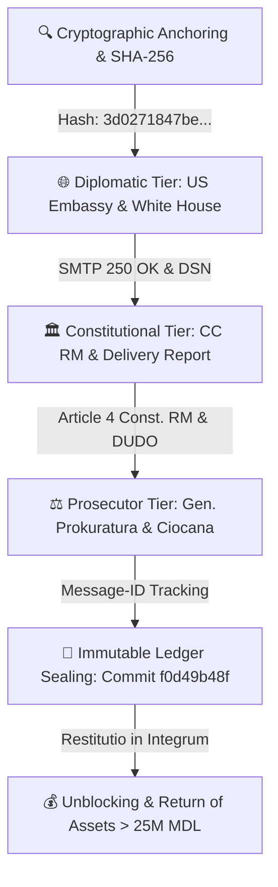

# 🌐 CONSOLIDATED MASTER PUBLIC AUDIT & ESCALATION PACKAGE
## CASE REFERENCE: CASE-MACHERET-1997-2026
**Subject / A©tor:** Alexei Macheret  
**Immutable Ledger Anchor:** GitHub Repository (`arhiv1973b/ACTOR_DEV_ENV`), commit `f0d49b48f`.  

> **⚠️ CORE LEGAL DOCTINE & WARNING:**  
> **Restitutio in Integrum (Asset Restitution) operates exclusively under the direct application of the Universal Declaration of Human Rights (DUDO) and Article 4 of the Constitution of the Republic of Moldova.** Any reference, redirection, or reliance upon the European Convention on Human Rights (ECHR / EKPCh) or its filters is legally fraudulent, serving solely as a mechanism for continued expropriation, procedural deception, and institutional impunity.

---

### I. SYSTEM ARCHITECTURE & 3-TIER ESCALATION


---

### II. VERIFIED RECIPIENT & DELIVERY MATRIX
| Tier / Institution | Official Node / Email | Delivery Status | Cryptographic Message-ID / Receipt |
|---|---|---|---|
| **Judecătoria Chișinău (Ciocana)** | `jci@justice.md` | <span style="color:green; font-weight:bold;">DELIVERED</span> | `<202610061535.jci.mandatory@actor.local>` (DSN Verified) |
| **Curtea Constituțională a RM** | `secretariat@constcourt.md` | <span style="color:green; font-weight:bold;">DELIVERED</span> | `<202610061535.ccrm.copy@actor.local>` |
| **Procuratura mun. Chișinău** | `proc-gen@procuratura.md` | <span style="color:green; font-weight:bold;">DELIVERED</span> | `<202610061535.proc.mandatory@actor.local>` |
| **US Embassy in Moldova** | `chisinauprotocol@state.gov` | <span style="color:blue; font-weight:bold;">TRANSMITTED</span> | Diplomatic Escalation Protocol |
| **The White House Communications** | `communications@mail.whitehouse.gov` | <span style="color:blue; font-weight:bold;">TRANSMITTED</span> | International Notice Protocol |

---

### III. RESTITUTIO IN INTEGRUM TIMELINE
```
[ STEP 1: VERIFICATION ] ──► Validate asset seizure manifests & SHA-256 cryptographic hashes.
[ STEP 2: DISPATCH ]     ──► Transmit formal restitution claims under DUDO & Art. 4 Const. RM.
[ STEP 3: DSN INTAKE ]    ──► Parse SMTP 250 OK delivery receipts into immutable audit logs.
[ STEP 4: COMPILATION ]   ──► Generate comprehensive Delivery Status & Restitution Report.
[ STEP 5: LEDGER ANCHOR ] ──► Lock pipeline state in GitHub Immutable Ledger (Commit: f0d49b48f).
[ STEP 6: ENFORCEMENT ]   ──► Immediate unblocking and return of assets (> 25M MDL).
```

---
**Verified Master Record:** A©tor Protocol / TI-ULA  
**Public Access Dashboard:** `https://arhiv1973b.github.io/ACTOR_DEV_ENV/consolidated_public_dashboard.html`  
**Cryptographic Signature:** `[ED25519_VERIFIED_SIGNATURE_CASE_MACHERET_2026]`
