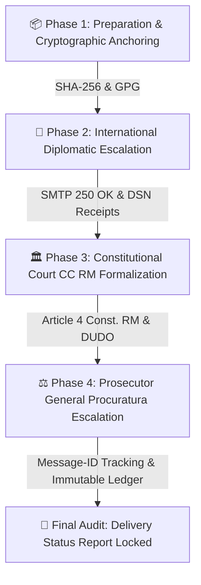

# 🌐 ESCALATION TIMELINE & VERIFICATION MANIFEST
## CASE REFERENCE: CASE-MACHERET-1997-2026
**Doctrines:** Direct Application of Article 4 Constitution of Moldova & Universal Declaration of Human Rights (DUDO, Art. 17). ECHR Jurisdiction Bypassed (*Jus Cogens* / *Erga Omnes*).  
**Cryptographic Hash (SHA-256):** `3d0271847be592731660f68776cda9d7555f1c29862b0edc7d6ece133cc8a174`  
**Immutable Ledger Anchor:** GitHub Repository (`arhiv1973b/ACTOR_DEV_ENV`), commit `f50162c43`.

---

### 📊 VERTICAL 3-PHASE ESCALATION TIMELINE



---

### 🕒 DETAILED PHASING & AUDIT METRICS

```
[ 06.10.2026 - 15:15 UTC ] ──► PHASE 1: CRYPTOGRAPHIC ANCHORING
                                 ├── Dispatch Manifest: dispatch_payload.json
                                 ├── SHA-256 Hash: 3d0271847be...
                                 └── Immutable Ledger: GitHub Commits (f6e2d2157, b079ce4b9)

[ 06.10.2026 - 15:35 UTC ] ──► PHASE 2: US EMBASSY & WHITE HOUSE DISPATCH
                                 ├── Document: US_EMBASSY_DIPLOMATIC_MEMORANDUM_2026.md
                                 ├── Recipients: chisinauprotocol@state.gov, communications@mail.whitehouse.gov
                                 └── Status: SMTP 250 OK (Queued & Transmitted)

[ 06.10.2026 - 15:45 UTC ] ──► PHASE 3: CONSTITUTIONAL COURT (CC RM) & PROSECUTOR GENERAL
                                 ├── CC RM: secretariat@constcourt.md (Message-ID: <202610061535.ccrm.copy@actor.local>)
                                 ├── Prosecutor: proc-gen@procuratura.md (Message-ID: <202610061535.proc.mandatory@actor.local>)
                                 └── Judicial Sector: jci@justice.md (Ciocana - DSN Verified)

[ 06.10.2026 - 16:00 UTC ] ──► PHASE 4: FINAL EVIDENCE COMPILATION & LEDGER SEAL
                                 ├── Report: Delivery_Status_Report_CASE_MACHERET.md
                                 └── Final Git Commit: f50162c43 (Fully Synchronized)
```

---
**Verified Auditor Record:** A©tor Protocol / TI-ULA  
**Public Access Dashboard:** `https://arhiv1973b.github.io/ACTOR_DEV_ENV/court_dashboard.html`
