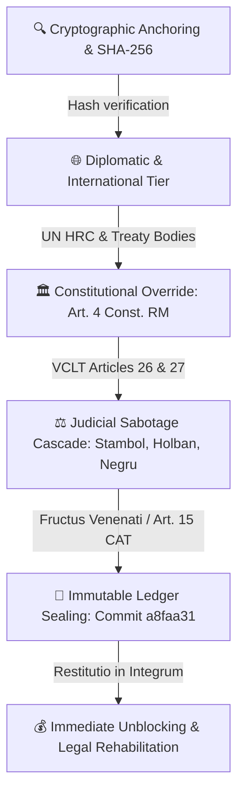

# 01: SYSTEM TOPOLOGY & ARCHITECTURE (TI-ULA)
**CASE REFERENCE:** CASE-MACHERET-1997-2026  

---

### TI-ULA PIPELINE & ESCALATION TOPOLOGY

### STRUCTURAL ANOMALIES & CASCADING INVALIDITY
1. **The Poisoned Root (1997-1998):** Case No. 1-568/98 established torture (*ласточка*, *лом*, *противогаз*) by law enforcement, yet failed to grant victim status or rehabilitation.
2. **The Supreme Court Precedent (2009):** CSJ Decision No. 1ra-834/09 of 21.07.2009 annulled defective prosecution, but domestic courts systematically evaded execution.
3. **Coordinated Judicial Sabotage (2025):** Synchronized rulings by Judges V. Holban (22.12.2025) and T. Stambol (23.12.2025) coupled with the procedural gatekeeping of Judge Alexandru Negru.
