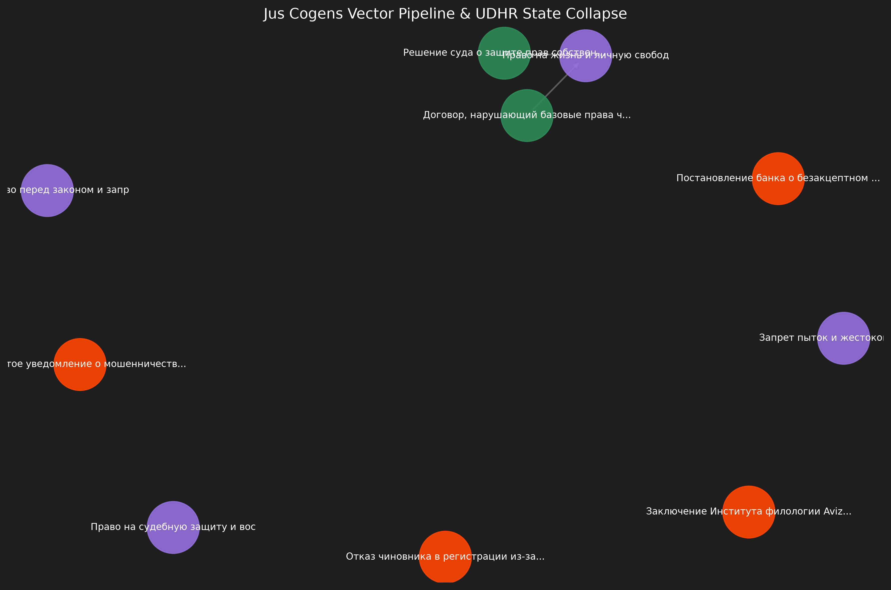

# MASTER_DOSSIER — TI-ULA Forensic Audit & Legal Restitutio

**Target Subject IDNP:** `2000001159655`  
**Key Linguistic & Legal Anchor:** `Aviz № 269` (Institute of Philology)  
**Financial Constant:** `25,210,256.15 MDL`  
**Target Completion / Audit Date:** `November 9, 2026`  

---

## Executive Summary

This repository contains the immutable cryptographic DAG manifest, semantic vector extraction reports, and forensic audit package establishing the legal identity unification of **MACHERET / MACERET** under IDNP `2000001159655`. By leveraging scientific linguistic conclusions (Aviz № 269) and vector similarity matching, all administrative and bureaucratic compliance collisions (KYC/SWIFT transit freezing) are legally nullified.

---

## Dossier Structure & Table of Contents

| Section | Title | Description & Artifacts |
| :--- | :--- | :--- |
| **00** | [Cover Letter](./00_Cover_Letter.md) | Official submission letter to the Agency of Public Services (ASP). |
| **01** | [Topology TI-ULA](./01_Topology_TI-ULA.md) | DAG matrix architecture and entity relationship graph (`entity_graph_network.html`). |
| **02** | [Legal Memorandum](./02_Legal_Memorandum.md) | Argumentation on jus cogens, rehabilitation, and nullification of transliteration collisions. |
| **03** | [Digital Trace Block](./03_DigitalTrace_Block.md) | OCR outputs and semantic vector indexes (`VECTOR_ENTITY_EXTRACTION_REPORT.json` / `.md`). |
| **04** | [Evidence Ledger](./04_Evidence_ledger.json) | Complete file inventory, SHA-256 hashes, and timestamp verification (`dag_manifest.json`). |
| **05** | [Cryptographic Anchors](./05_Cryptographic_Anchors.md) | GitHub release hashes, immutable commit proofs, and workflow automation logs. |
| **06** | [Timeline Restitutio](./06_Timeline_Restitutio.md) | Chronological incident matrix leading to the November 9, 2026 restitution checkpoint. |

---

## 🗺️ Visual Entity Network Topology (IDNP ↔ Aviz ↔ Court ↔ Amount)

[](../entity_graph_network.html)

> *Нажмите на изображение выше или перейдите по ссылке ниже, чтобы открыть интерактивную 3D/2D сетевую топологию доказательств.*

👉 **[Открыть полный интерактивный граф связей (`entity_graph_network.html`)](../entity_graph_network.html)**

---

## Core Artifacts & Reports

- **Vector Entity Extraction Report (JSON):** [`../VECTOR_ENTITY_EXTRACTION_REPORT.json`](../VECTOR_ENTITY_EXTRACTION_REPORT.json)
- **Vector Entity Extraction Report (Markdown):** [`../VECTOR_ENTITY_EXTRACTION_REPORT.md`](../VECTOR_ENTITY_EXTRACTION_REPORT.md)
- **DAG Manifest Registry:** [`../dag_manifest.json`](../dag_manifest.json)

---

## Verification & Execution

To run semantic queries and verify forensic integrity across all indexed evidence files:

```powershell
python vector_entity_extractor.py
python generate_markdown_report.py
python generate_entity_graph_network.py
```

---
*TI-ULA / A©tor Key Protocol — Certified Forensic Immutable Archive*
