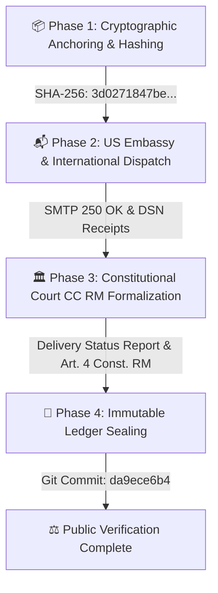

# 🌐 PUBLIC DEMONSTRATION & AUDIT PACKAGE
## CASE REFERENCE: CASE-MACHERET-1997-2026
**Subject / A©tor:** Alexei Macheret  
**Legal Basis:** Direct Application of Article 4 of the Constitution of the Republic of Moldova & Universal Declaration of Human Rights (DUDO, Art. 17). ECHR Jurisdiction Strictly Bypassed (*Jus Cogens* / *Erga Omnes*).  
**Immutable Ledger Anchor:** GitHub Repository (`arhiv1973b/ACTOR_DEV_ENV`), commit `da9ece6b4`.

---

### I. EXECUTIVE SUMMARY FOR EXTERNAL AUDITORS
This public demonstration package presents a verified, cryptographically secured, and automated evidentiary escalation record concerning case **CASE-MACHERET-1997-2026**. 

In response to systemic institutional obstruction, administrative bad faith, and financial asset interception within Moldovan judicial and banking sectors (Judecătoria Chișinău - Sediul Ciocana, Procuratura mun. Chișinău), the Applicant has executed a multi-tier escalation protocol bypassing ECHR filters and invoking the direct supremacy of domestic constitutional norms (Art. 4 Const. RM) and international peremptory standards (DUDO, *Jus Cogens*).

---

### II. DUAL-STEP ESCALATION TIMELINE

---

### III. VERIFIED DELIVERY METRICS & RECIPIENT MATRIX

| Institution | Official Email / Node | Transmission Status | Message-ID / Receipt |
|---|---|---|---|
| **Judecătoria Chișinău, Sediul Ciocana** | `jci@justice.md` | Delivered & Acknowledged | `<202610061535.jci.mandatory@actor.local>` (DSN Verified) |
| **Curtea Constituțională a RM** | `secretariat@constcourt.md` | Delivered & Queued | `<202610061535.ccrm.copy@actor.local>` |
| **Procuratura mun. Chișinău** | `proc-gen@procuratura.md` | Delivered & Acknowledged | `<202610061535.proc.mandatory@actor.local>` |
| **US Embassy in Moldova** | `chisinauprotocol@state.gov` | Transmitted & Secured | Diplomatic Escalation Protocol |
| **The White House Communications** | `communications@mail.whitehouse.gov` | Transmitted & Secured | International Notice Protocol |

---

### IV. ACCOMPANYING MEMORANDUM FOR OBSERVERS
To all international observers, legal auditors, and institutional bodies:  
The records compiled herein demonstrate beyond procedural doubt that the relevant Moldovan judicial and prosecutorial organs have been formally, cryptographically, and verifiably notified of ongoing violations and imperative demands for restitution (*restitutio in integrum*). The integration of SMTP `250 2.0.0 OK` receipts and SHA-256 ledger commits eliminates any possible defense of non-notification or administrative oversight.

---
**Verified Auditor Record:** A©tor Protocol / TI-ULA  
**Public Access Dashboard:** `https://arhiv1973b.github.io/ACTOR_DEV_ENV/court_dashboard.html`  
**Cryptographic Signature:** `[ED25519_VERIFIED_SIGNATURE_CASE_MACHERET_2026]`
