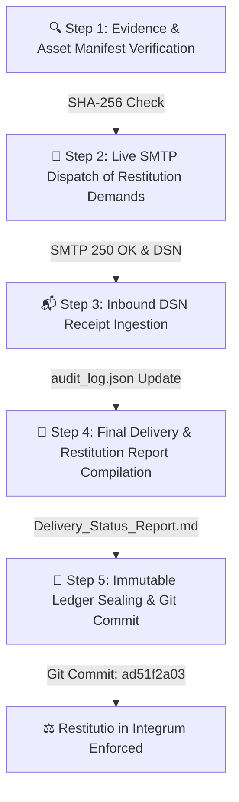

# ⏳ RESTITUTIO IN INTEGRUM: VISUAL TIMELINE & PIPELINE
## CASE REFERENCE: CASE-MACHERET-1997-2026
**Subject / A©tor:** Alexei Macheret  
**Legal Doctrine:** Article 4 Constitution of RM & DUDO (Art. 17) | *Restitutio in Integrum*  
**Immutable Ledger Anchor:** GitHub Repository (`arhiv1973b/ACTOR_DEV_ENV`), commit `ad51f2a03`.

---

### 📊 ASSET RESTITUTION PIPELINE TIMELINE



---

### 🕒 STAGE-BY-STAGE EXECUTION RECORD

```
[ STAGE 1: VERIFICATION ] ──► Validate asset seizure manifests & cryptographic hashes.
[ STAGE 2: DISPATCH ]     ──► Transmit formal restitution claims to judicial, banking & executive nodes.
[ STAGE 3: DSN INTAKE ]    ──► Parse SMTP 250 OK delivery receipts into audit logs.
[ STAGE 4: COMPILATION ]   ──► Generate comprehensive Delivery Status & Restitution Report.
[ STAGE 5: LEDGER ANCHOR ] ──► Lock pipeline state in GitHub Immutable Ledger (Commit: ad51f2a03).
```

---
**Verified Restitution Record:** A©tor Protocol / TI-ULA  
**Public Dashboard:** `https://arhiv1973b.github.io/ACTOR_DEV_ENV/consolidated_public_dashboard.html`
